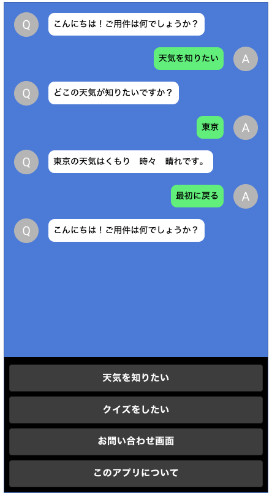
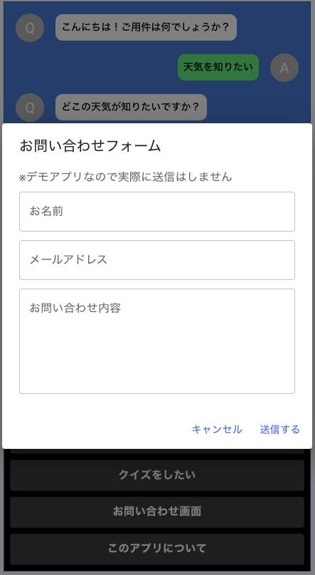

# [Chatbot](https://chatbot-a99d5.web.app/)

## 概要

YouTube で公開されている講座を参考に React で作成したチャットボット。

参考元は JavaScript ですが TypeScript で作っています。

## デプロイ

[Firebase](https://chatbot-a99d5.web.app/)


　

## 使用技術

React, TypeScript, ESLint, Prettier, Material-UI

Firebase, 天気API(気象庁サイトからJSON取得)


## セットアップ

```
yarn install
yarn start
```

コードフォーマット

```
yarn lint
```

## 参考

日本一わかりやすい React 入門【実践編】#1...React でチャットボットを作ろう<br/>
https://www.youtube.com/watch?v=MzJkWO73S70
